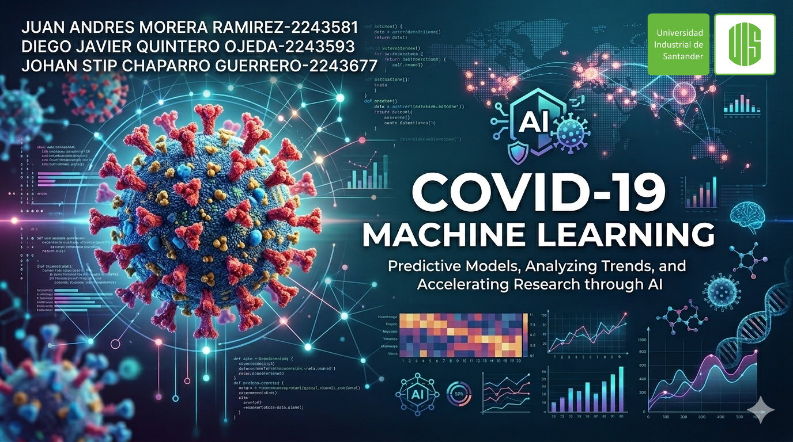

## 🦠COVID19_Machine_Learning
Proyecto de Machine Learning aplicado al análisis de COVID-19

  

## 👥 Autores
- **Juan Andres Morera Ramirez-2243581**  
- **Diego Javier Quintero Ojeda-2243593**  
- **Johan Stip Chaparro Guerrero-2243677**

---

## 🎯 Objetivo

Desarrollar modelos de Machine Learning para analizar datos relacionados con COVID-19 e identificar patrones importantes en pacientes.
Comparar diferentes algoritmos predictivos para mejorar la detección y análisis de riesgos asociados a la enfermedad.

---

## 🗂️ Dataset

Este proyecto utiliza el siguiente conjunto de datos público:

https://www.kaggle.com/datasets/meirnizri/covid19-dataset?resource=download

El dataset contiene información relacionada con pacientes y variables asociadas al COVID-19, utilizada para aplicar técnicas de Machine Learning y análisis predictivo.

Incluye variables como:

-Edad
-Condiciones médicas
-Resultados clínicos
-Factores de riesgo
-Variables categóricas y numéricas relacionadas con COVID-19

Aplicación en el proyecto:

-Clasificación de pacientes
-Predicción de riesgo y gravedad
-Entrenamiento de modelos supervisados
-Reducción de dimensionalidad con PCA
-Clustering con K-Means
-Deep Learning para análisis predictivo

El conjunto de datos fue procesado mediante técnicas de limpieza, escalado y balanceo para mejorar el rendimiento de los modelos de Machine Learning.

---

## 🤖 Modelos Usados

En el desarrollo del proyecto se emplearon los siguientes modelos de Machine Learning:

- **DecisionTreeRegressor** – Modelo basado en árboles de decisión para clasificación de pacientes.
- **RandomForestRegressor** – Bosques aleatorios utilizando múltiples árboles para mejorar la precisión y reducir el sobreajuste.
- **SVR (Support Vector Regressor)** – Modelo de clasificación utilizado para encontrar la mejor separación entre clases.
- **K-Means** – Algoritmo de clustering utilizado para agrupar pacientes con características similares.
- **PCA (Principal Component Analysis)** – Técnica de reducción de dimensionalidad para simplificar y visualizar los datos.
- **Red Neuronal (TensorFlow / Keras)** – Modelo denso con múltiples capas ocultas y funciones de activación ReLU para Deep Learning.
  
Todos los modelos fueron evaluados mediante métricas de clasificación como Accuracy, Precision, Recall y F1-Score, además de validación cruzada en algunos casos.

---

## 📓 Notebook de Google Colab

🔗 **Colab del proyecto:**  

https://colab.research.google.com/drive/1nSpLDpK6OaxgiOIefXFuxNkd3vWRvXU7#scrollTo=oZDkm8y10xBM

---

## 🎬 Video Explicativo

🔗 **Presentación del proyecto (video):**  

https://youtu.be/Otg3J5AO0NI

